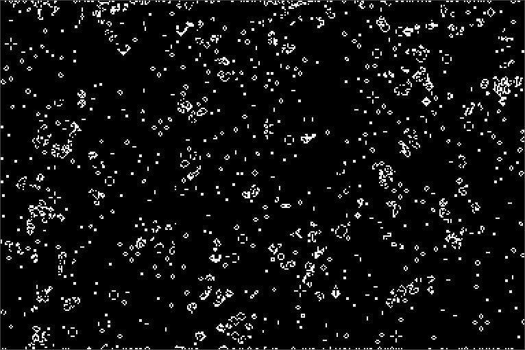

# Overview
Conway's Game of Life.

4 rules:
1. Live cells with less than two live neighbours die.
2. Live cells with two or three live neighbours live.
3. Live cells with more than three live neighbours die.
4. Dead cells with three live neighbours becomes live.

In the software, these rules are reduced to "live if...":
1. 3 live neighbors OR
2. 2 live neighbors AND current cell live

# Resources
- [Wikipedia - Conway's Game of Life](https://en.wikipedia.org/wiki/Conway%27s_Game_of_Life)
